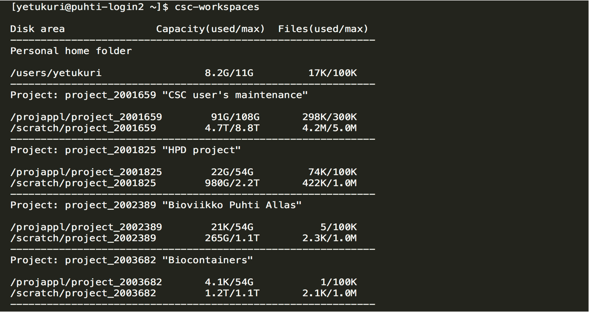
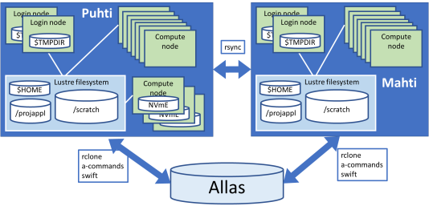
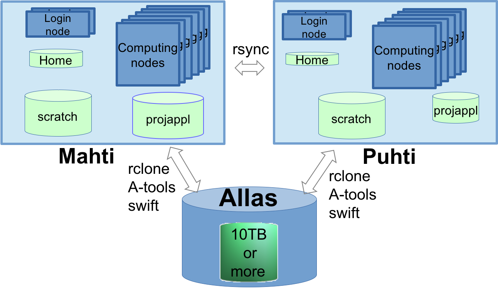

--
theme: csc-2019
lang: en
--

# Disk areas in CSC HPC environment {.title}
In this section, you will learn how to manage different disk areas in HPC environment at CSC

# Overview of disk areas

- Main disk areas and their specific uses in Puhti/Mahti
- Understanding quotas (both usable space and number of files) for different disk areas
- Moving data between supercomputers
- Additional fast disk areas

# Main disk areas in Puhti/Mahti
- Home directory ($HOME)
- ProjAppl directory (/projapple/project_name)
- Scratch directory (/scratch/project_name)
- Note that:
    - you can find default quotas of each directory on [disk areas section](https://docs.csc.fi/computing/disk) of CSC documentation pages
    - any files on `scratch` that have not been used for 90 days will be automatically removed
    - no more earlier concepts of personal $WRKDIR/persistent project directories or DONOTREMOVE directories

# Displaying current status of disk areas
- use `csc-workspaces` command to display available projects and quotas 

# Disk and storage overview  

# Moving data between supercomputers
- Puhti and Mahti have their own disk systems
- Data can be [moved between the supercomputers](https://docs.csc.fi/data/moving/rsync/) and [CSC object storage](https://docs.csc.fi/data/Allas/)

# Additional fast disk areas 
- Login nodes
    - Each of the login nodes have 2900 GiB of fast local storage `$TMPDIR`
    - The local storage is meant for temporary storage and is cleaned frequently
- Compute nodes in Puhti
    - Interactive batch jobs as well as jobs running in the IO- and gpu-nodes have local fast storage
    - You must copy all the data that you want to preserve from these temporary disk areas to scratch directory or to Allas

# What are the different disk areas for?
- [Allas](https://docs.csc.fi/data/Allas/) - for data which is not actively used
- [HOME](https://docs.csc.fi/computing/disk/) - small, thus only for most important (small) files
- [scratch](https://docs.csc.fi/computing/disk/) - main working area, can be used to share with project members
- [projappl](https://docs.csc.fi/computing/disk/) - not cleaned up 
- [local tmp](https://docs.csc.fi/computing/disk/) - compiling, temporary, fast IO 
- [NVMe](https://docs.csc.fi/computing/disk/) - fast IO in batch jobs

# Some best practice tips
- don't put databases on Lustre (projappl, scratch, home) -> use other CSC services like [kaivos](https://docs.csc.fi/data/kaivos/overview/) and mongoDB
- don't create a lot of files in one folder
- don't create overall a lot of files (if you're creating tens of thousands of files, you should probably rethink the workflow)
