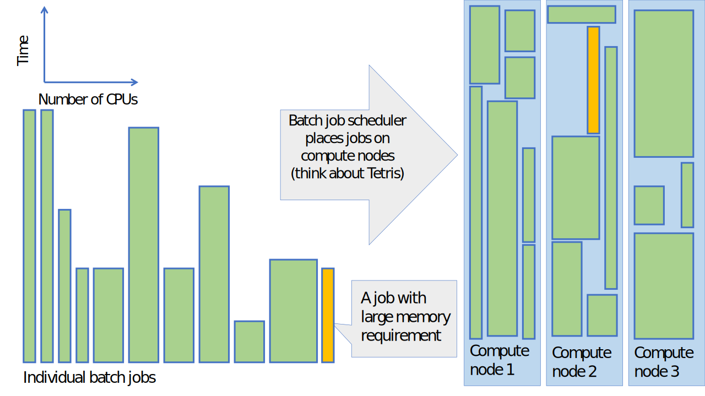

--
theme: csc-2019
lang: en
--

# The batch job system in CSC's HPC environment {.title}

# What is a batch job system?

- Optimizes resource usage by filling the server with jobs
- The batch system allows users to submit jobs requesting the resources (runtime, nodes, cores, memory, GPUs) that they need 
- The jobs are queued and then run as resources become available
- The order in which queued jobs start depend on available resources and their priority

# Batch job system places jobs on compute nodes

# The batch job system in CSC's HPC environment 

- jobs don't start instantly but are put in a queue (partition)
- CSC uses a batch job system (SLURM) to execute computing tasks
- SLURM is used to control how the overall computing resources are shared among all projects in an efficient and fair way
- SLURM controls how a single job request gets resources, like:
    - computing time
    - number of cores
    - amount of memory
    - other resources like gpu, local disk, etc.

# Available batch job partitions

- [The available batch job partitions](https://docs.csc.fi/computing/running/batch-job-partitions/)
- in order use the resources in an efficient way, it is important to estimate the request as accurately as possible
- by avoiding an excessive "just-in-case" request, the job will start earlier 
- consult our [Getting started with the batch job system ](https://docs.csc.fi/computing/running/getting-started/)

# Different type of HPC jobs

- typically an HPC job can be classified as serial, parallel or gpu, depending on the main requested resource 
- each batch job is billed using a scheme that takes into account the requested resources
- Note that the billing is based on the actual time a job has used, not the reserved maximum time 
- see the [Billing unit (BU) and price calculator at research.csc.fi](https://research.csc.fi/billing-and-monitoring#buc)
- the billing is done per project
- via the [My Projects page in MyCSC](https://my.csc.fi/welcome) you can monitor the BU consumption and apply for more billing units
- "csc-projects" is a command line tool for showing the the BU consumption per project    

# HPC serial jobs 

- why could your serial job benefit from being executed using CSC's resources instead of on your own computer? 

    - part of a larger workflow
    - avoid data transfer between CSC and your own computer
    - data sharing among other project members
    - CSC's software licensing
    - memory and/or disk demands

- serial resources are only available in Puhti 
 
# HPC parallel jobs

- in a parallel job the calculation is distributed over several cores in order to achieve a shorter wall time (and/or a larger allocatable memory)   
- there are two major parallelization schemes: [OpenMP](https://en.wikipedia.org/wiki/OpenMP) and [MPI](https://en.wikipedia.org/wiki/Message_Passing_Interface)
- depending on the parallellization scheme there is a slight difference between how the resource reservation is done  
- [examples of batch job skripts on Puhti](https://docs.csc.fi/computing/running/creating-job-scripts-puhti/)
- [examples of batch job skripts on Mahti](https://docs.csc.fi/computing/running/example-job-scripts-mahti/)

# HPC gpu jobs 

- CSC's gpu resources are relatively scarce and hence should be used with particular care
- each reserved gpu card consumes 60 BU per hour compared to 1 BU per cpu core
FIXME: tassa voisi linkata gpu-usage-policyyn (julkaistan pian)

# Interactive jobs

- when you login to CSC's supercomputers, you end up in one of the login nodes of the computer. These login nodes are shared by all users and they are not intended for heavy computing. 
- if you have a heavier job that still requires interactive response (e.g. graphical user interface )
    - allocate the resource via the the [interactive partition](https://docs.csc.fi/computing/running/interactive-usage/)
